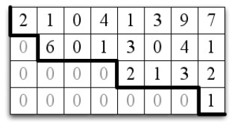

# Chap 08

# 가우스 소거법 - Gaussian Elimination

가우스 소거법(Gaussian Elimination)은 선형방정식의 시스템에 대한 해를 구하는 데에 가장 자주 적용된다. 가우스 소거법은 주로 아래와 같은 곳에 적용된다.

- *주어진 벡터들의 생성에 대한 기저 찾기*
- *행렬의 영공간에 대한 기저 찾기*
- *행렬방정식의 해 구하기*


## 8.1 사다리꼴 - Echelon Form

*사다리꼴(Echelon form)* 행렬은 삼각행렬을 일반화한 것이다. 아래의 행렬은 사다리꼴 행렬의 예시이다.
$$
\begin{bmatrix} 0 & 2 & 3 & 0 & 5 & 6 \\ 0 & 0 & 1 & 0 & 3 & 4 \\ 0 & 0 & 0 & 0 & 1 & 2 \\ 0 & 0 & 0 & 0 & 0 & 9 \end{bmatrix}
$$

- 행 $0$의 첫 번째 영이 아닌 엔트리는 열 $1$에 있다.
- 행 $1$의 첫 번째 영이 아닌 엔트리는 열 $2$에 있다.
- 행 $2$의 첫 번째 영이 아닌 엔트리는 열 $4$에 있다.
- 행 $3$의 첫 번째 영이 아닌 엔트리는 열 $5$에 있다.


***Definition*** : $m \times n$ 행렬 $A$는 다음 조건을 만족하면 *사다리꼴* 이다. 즉, 임의의 행에 대해, 만약 그 행의 첫 번째 영이 아닌 원소가 위치 $k$에 있으면 그 행 이전의 모든 행의 첫 번째 영이 아닌 원소는 $k$보다 작은 어떤 위치에 있다. <br />

즉, 다음과 같은 행렬이 사다리꼴 행렬이라 할 수 있다. ($*$ 은 아무 숫자나 올 수 있다.)
$$
\begin{bmatrix} * & * & * & * \\ 0 & * & * & * \\ 0 & 0 & * & * \end{bmatrix}
$$
위의 Definition에 의하면 $A$의 각 행에 대해 반복할 때마다 각 행의 첫 번째 영이 아닌 엔트리는 반드시 오른쪽으로 이동하여 오른쪽 아래로 내려가는 계단모양을 형성한다.



만약, 아래의 예시와 같이 사다리꼴 행렬에서 어떤 행이 모두 영이면, 그 행 다음에 오는 모든 행 또한 모두 영이어야 한다.
$$
\begin{bmatrix} 0 & 2 & 3 & 0 & 5 & 6 \\ 0 & 0 & 1 & 0 & 3 & 4 \\ 0 & 0 & 0 & 0 & 0 & 0 \\ 0 & 0 & 0 & 0 & 0 & 0 \end{bmatrix}
$$


### 8.1.1 사다리꼴에서 행공간에 대한 기저로

사다리꼴로 된 행렬이 가지는 장점은 무엇일까? <br />

***Lemma*** : 만약 어떤 행렬이 사다리꼴이면, 영이 아닌 행들은 행공간에 대한 기저를 형성한다. 

- 예를 들어, 다음 행렬

$$
\begin{bmatrix} 0 & 2 & 3 & 0 & 5 & 6 \\ 0 & 0 & 1 & 0 & 3 & 4 \\ 0 & 0 & 0 & 0 & 0 & 0 \\ 0 & 0 & 0 & 0 & 0 & 0 \end{bmatrix}
$$

- 의 행공간에 대한 기저는 $\{[0, 2, 3, 0, 5, 6], [0,0,1,0,3,4]\}$ 이다.


*8.1.2 생략*

### 8.1.3 맨 왼쪽의 영이 아닌 위치에 의한 행들의 정렬

모든 행렬이 사다리꼴 형태를 가지는 것은 아니다. 이번 8.1.3에서는 사다리꼴이 아닌 행렬을 사다리꼴 행렬로 변환하는 방법에 대해 알아 보도록 하자. <br />

사다리꼴 행렬은 위의 Definition에서 처럼 맨 왼쪽의 영이 아닌 원소의 위치에 따라 정렬되어야 한다. 아래와 같이 행렬 $A$가  있다고 해보자.
$$
A=\begin{bmatrix} 0 & 2 & 3 & 4 & 5 \\ 0 & 0 & 0 & 3 & 2 \\ 1 & 2 & 3 & 4 & 5 \\ 0 & 0 & 0 & 6 & 7 \\ 0 & 0 & 0 & 9 & 9 \end{bmatrix}
$$
이를 사다리꼴 행렬로 바꾸기 위해서는 행렬 중 행의 성분을 사다리꼴 형태가 되도록 위치를 바꿔주는 피보팅(pivoting)과정이 필요하다. 피보팅 과정을 거치면 아래와 같은 행렬이 된다.
$$
A=\begin{bmatrix} 1 & 2 & 3 & 4 & 5 \\ 0 & 2 & 3 & 4 & 5 \\ 0 & 0 & 0 & 3 & 2 \\ 0 & 0 & 0 & 6 & 7 \\ 0 & 0 & 0 & 9 & 9 \end{bmatrix}
$$
이제 이러한 피보팅 작업을 해주는 과정을 파이썬 코드로 나타내 보자. 아래의 코드는 `pivoting()`메소드를 구현한 코드이다.

```python
def pivoting(mat):
    row_idx = list(range(len(mat)))
    col_idx = len(mat[0])
    pivot_mat = []
    for c in range(col_idx):
        rows_with_nonzero = [r for r in row_idx if mat[r][c] != 0]
        if rows_with_nonzero:
            pivot = rows_with_nonzero[0]
            for idx in rows_with_nonzero:
                pivot_mat.append(mat[idx])
                row_idx.remove(idx)
    return pivot_mat
```

```python
A = [[0, 2, 3, 4, 5], 
     [0, 0, 0, 3, 2], 
     [1, 2, 3, 4, 5], 
     [0, 0, 0, 6, 7], 
     [0, 0, 0, 9, 9]]

from pprint import pprint 
pprint(pivoting(A))
'''출력결과
[[1, 2, 3, 4, 5],
 [0, 2, 3, 4, 5],
 [0, 0, 0, 3, 2],
 [0, 0, 0, 6, 7],
 [0, 0, 0, 9, 9]]
'''
```


위의 pivoting 과정을 거쳐 나온 행렬 $A$는 사다리꼴 행렬이라고 할 수 없다. 그 이유는 네 번쨰 행과 다섯 번째 행의 처음으로 영이 아닌 원소는 네 번째 열에 위치하기 때문이다. 

### 8.1.4 기본행덧셈 연산 (Elementary row-addition operation)

이러한 문제를 해결하는 방법으로는 *elementary row-addtion operation* 이 있다. 영어로 써놔서 엄청 어려운 과정처럼 보이지만, 위의 행렬 $A$ 에서 사다리꼴 행렬이 되지 않는 원인인 네 번째와, 다섯 번째의 행을 세 번째의 행으로 *곱셈과 뺼셈* 을 이용해 해당 원소를 $0$으로 만들어 주면 된다. <br />

네 번째 행 $\begin{bmatrix} 0 & 0 & 0 & 6 & 7 \end{bmatrix}$ 은 아래와 같이 세 번째 행 $\begin{bmatrix} 0 & 0 & 0 & 3 & 2 \end{bmatrix}$를 이용해 네 번째 열의 원소를 $0$으로 만들어 줄 수 있다.
$$
\begin{bmatrix} 0 & 0 & 0 & 6 & 7 \end{bmatrix}-2\begin{bmatrix} 0 & 0 & 0 & 3 & 2 \end{bmatrix}=\begin{bmatrix} 0 & 0 & 0 & 0 & 3 \end{bmatrix}
$$
다섯 번째 행 $\begin{bmatrix} 0 & 0 & 0 & 9 & 9 \end{bmatrix}$는,
$$
\begin{bmatrix} 0 & 0 & 0 & 9 & 9 \end{bmatrix}-3\begin{bmatrix} 0 & 0 & 0 & 3 & 2 \end{bmatrix}=\begin{bmatrix} 0 & 0 & 0 & 0 & 3 \end{bmatrix}
$$
이된다. 따라서, 아래와 같은 행렬이 얻어진다.
$$
A^{'} = \begin{bmatrix} 1 & 2 & 3 & 4 & 5 \\ 0 & 2 & 3 & 4 & 5 \\ 0 & 0 & 0 & 3 & 2 \\ 0 & 0 & 0 & 0 & 3 \\ 0 & 0 & 0 & 0 & 3 \end{bmatrix}
$$
$A^{'}$ 행렬에서 네 번째행을 이용하여,
$$
\begin{bmatrix} 0 & 0 & 0 & 0 &3 \end{bmatrix}-1\begin{bmatrix} 0 & 0 & 0 & 0 & 3 \end{bmatrix}=\begin{bmatrix} 0 & 0 & 0 & 0 & 0 \end{bmatrix}
$$
다섯 번째행을 $\begin{bmatrix} 0 & 0 & 0 & 0 & 0 \end{bmatrix}$ 으로 만들어 주게 되어, 최종적으로 아래와 같은 행렬이 만들어 진다.
$$
A^{''} = \begin{bmatrix} 1 & 2 & 3 & 4 & 5 \\ 0 & 2 & 3 & 4 & 5 \\ 0 & 0 & 0 & 3 & 2 \\ 0 & 0 & 0 & 0 & 3 \\ 0 & 0 & 0 & 0 & 0 \end{bmatrix}
$$

위의 elementary row-addition operation 과정을 파이썬 코드로 나타내면 아래와 같다. 아래의 코드는 위에서 본 `pivoting()`메소드에서 elementary row-addition operation 과정을 추가해준 코드이다. 

```python
def row_reduce(mat):
    rref = []
    row_idx = list(range(len(mat)))
    col_idx = len(mat[0])
    for c in range(col_idx):
        rows_with_nonzero = [r for r in row_idx if mat[r][c] != 0]
        if rows_with_nonzero:
            pivot = rows_with_nonzero[0]
            row_idx.remove(pivot)
            rref.append(mat[pivot])
            for r in rows_with_nonzero:
                if r is not pivot:
                    multiplier = mat[r][c] / mat[pivot][c]
                    mat[r] = [a - multiplier*b for a, b in zip(mat[r], mat[pivot])]           
    for r in row_idx:
        rref.append(mat[r])
    return rref


mat = [[0, 2, 3, 4, 5], 
       [0, 0, 0, 3, 2], 
       [1, 2, 3, 4, 5], 
       [0, 0, 0, 6, 7], 
       [0, 0, 0, 9, 9]]

row_reduce(mat)
'''
[[1, 2, 3, 4, 5],
 [0, 2, 3, 4, 5],
 [0, 0, 0, 3, 2],
 [0.0, 0.0, 0.0, 0.0, 3.0],
 [0.0, 0.0, 0.0, 0.0, 0.0]]
'''
```


### 8.1.5 기본행덧셈 행렬에 의한 곱셈

8.1.4에서 보았듯이, 한 행의 배수로 다른 행에서 빼는 것은 그 행렬을 기본행덧셈 행렬(*elementary row-addition matrix*)과 곱합으로써 구할 수 있다.
$$
\begin{bmatrix} 1 & 0 & 0 & 0 \\ 0 & 1 & 0 & 0 \\ 0 & 0 & 1 & 0 \\ 0 & 0 & -2 & 1 \end{bmatrix}\begin{bmatrix} 1 & 2 & 3 & 4 & 5 \\ 0 & 2 & 3 & 4 & 5 \\ 0 & 0 & 0 & 3 & 2 \\ 0 & 0 & 0 & 6 & 7 \end{bmatrix}=\begin{bmatrix} 1 & 2 & 3 & 4 & 5 \\ 0 & 2 & 3 & 4 & 5 \\ 0 & 0 & 0 & 3 & 2 \\ 0 & 0 & 0 & 0 & 3 \end{bmatrix}
$$


### 8.1.6 행덧셈 연산은 행공간을 유지한다.

행렬을 사다리꼴로 변환하는 목적은 그 행렬의 행공간에 대한 기저를 얻기 위해서 이다. 조금 있다가 살펴보겠지만, 행덧셈 연산은 행공간을 바꾸지 않는다. 따라서, 변환된 행렬(*사다리꼴 행렬* )의 행공간에 대한 기저는 원래 행렬에 대한 기저이다. <br />

***Lemma*** : 행렬 $A$와 $N$에 대해, **Row** $NA \subseteq$ **Row** $A$ 이다. 

- **proof** : $v$는 **Row** $NA$ 의 임의의 벡터라고 하면, $v$는 $NA$의 행들의 선형결합이다. [벡터-행렬 곱셈의 선형결합 정의](https://render.githubusercontent.com/view/ipynb?commit=a97999f3f948f9263d847d91cb42836c8a75eb29&enc_url=68747470733a2f2f7261772e67697468756275736572636f6e74656e742e636f6d2f457863656c73696f72434a482f53747564792f613937393939663366393438663932363364383437643931636234323833366338613735656232392f4c696e656172416c67656272612f436f64696e675468654d61747269782f4368617030352532302d2532305468652532304d61747269782f4368617030352d5468655f4d61747269782e6970796e62&nwo=ExcelsiorCJH%2FStudy&path=LinearAlgebra%2FCodingTheMatrix%2FChap05+-+The+Matrix%2FChap05-The_Matrix.ipynb&repository_id=116745719&repository_type=Repository#5.5.2-%EC%84%A0%ED%98%95%EA%B2%B0%ED%95%A9%EC%9D%98-%EB%B2%A1%ED%84%B0-%ED%96%89%EB%A0%AC-%EA%B3%B1%EC%85%88)에 의하면 다음을 만족하는 벡터 $u$가 있다.

$$
v=\begin{bmatrix}  & { u }^{ T } &  \end{bmatrix}\left( \begin{bmatrix}  &  &  \\  & N &  \\  &  &  \end{bmatrix}\begin{bmatrix}  &  &  \\  & A &  \\  &  &  \end{bmatrix} \right) 
$$

$$
=\left( \begin{bmatrix}  & { u }^{ T } &  \end{bmatrix}\begin{bmatrix}  &  &  \\  & N &  \\  &  &  \end{bmatrix} \right) \begin{bmatrix}  &  &  \\  & A &  \\  &  &  \end{bmatrix}
$$

- 따라서 $v$가 $A$의 행들의 선형결합으로 표현될 수 있음을 보여준다.


***Corollary*** : 행렬 $A$와 $M$에 대해, 만약 $M$이 가역적이면 **Row** $MA=$ **Row** $A$ 이다.

- **proof** : $N=M$을 가지고 위의 *Lemma* 에 적용하면, Row $MA \subseteq$ Row $A$를 얻는다. $B=MA$라고 하면, $M$은 가역적이므로, 역행렬 $M^{-1}$가 존재한다. $N=M^{-1}$을 가지고 위의 *Lemma* 에 적용하면 Row $M^{-1}B \subseteq$ Row $B$를 얻는다. $M^{-1}B=M^{-1}(MA)=(M^{-1}M)A=IA=A$이므로, Row $A \subseteq$ Row $MA$ 이 증명된다. 


***Example 8.1.5*** : 다음의 예를 보자.
$$
A=\begin{bmatrix} 0 & 2 & 3 & 4 & 5 \\ 0 & 0 & 0 & 3 & 2 \\ 1 & 2 & 3 & 4 & 5 \\ 0 & 0 & 0 & 6 & 7 \\ 0 & 0 & 0 & 9 & 8 \end{bmatrix},M=\begin{bmatrix} 1 & 0 & 0 & 0 & 0 \\ 0 & 1 & 0 & 0 & 0 \\ 0 & 0 & 1 & 0 & 0 \\ 0 & 0 & -2 & 1 & 0 \\ 0 & 0 & 0 & 0 & 1 \end{bmatrix}
$$
라고 하면, $MA=\begin{bmatrix} 0 & 2 & 3 & 4 & 5 \\ 0 & 0 & 0 & 3 & 2 \\ 1 & 2 & 3 & 4 & 5 \\ 0 & 0 & 0 & 0 & 3 \\ 0 & 0 & 0 & 9 & 8 \end{bmatrix}$ 이다. 위의 *Lemma* 를 이용하여 Row $MA \subseteq$ Row $A$ 이고   Row $A \subseteq$ Row $MA$ 임을 보여준다. Row $MA$에 속하는 모든 벡터 $v$는 다음과 같이 표현될 수 있다.
$$
v =\begin{bmatrix} u_{ 1 } & u_{ 2 } & u_{ 3 } & u_{ 4 } & u_{5} \end{bmatrix}MA
$$

$$
=\begin{bmatrix} u_{ 1 } & u_{ 2 } & u_{ 3 } & u_{ 4 } & u_{5} \end{bmatrix}\begin{bmatrix} 0 & 2 & 3 & 4 & 5 \\ 0 & 0 & 0 & 3 & 2 \\ 1 & 2 & 3 & 4 & 5 \\ 0 & 0 & 0 & 0 & 3 \\ 0 & 0 & 0 & 9 & 8 \end{bmatrix}
$$

$$
=\begin{bmatrix} u_{ 1 } & u_{ 2 } & u_{ 3 } & u_{ 4 } & u_{5} \end{bmatrix}\left( \begin{bmatrix} 1 & 0 & 0 & 0 & 0 \\ 0 & 1 & 0 & 0 & 0 \\ 0 & 0 & 1 & 0 & 0 \\ 0 & 0 & -2 & 1 & 0 \\ 0 & 0 & 0 & 0 & 1 \end{bmatrix} \begin{bmatrix} 0 & 2 & 3 & 4 & 5 \\ 0 & 0 & 0 & 3 & 2 \\ 1 & 2 & 3 & 4 & 5 \\ 0 & 0 & 0 & 6 & 7 \\ 0 & 0 & 0 & 9 & 8 \end{bmatrix} \right)
$$

$$
= \left( \begin{bmatrix} u_{ 1 } & u_{ 2 } & u_{ 3 } & u_{ 4 } & u_{5} \end{bmatrix} \begin{bmatrix} 1 & 0 & 0 & 0 & 0 \\ 0 & 1 & 0 & 0 & 0 \\ 0 & 0 & 1 & 0 & 0 \\ 0 & 0 & -2 & 1 & 0 \\ 0 & 0 & 0 & 0 & 1 \end{bmatrix} \right)  \begin{bmatrix} 0 & 2 & 3 & 4 & 5 \\ 0 & 0 & 0 & 3 & 2 \\ 1 & 2 & 3 & 4 & 5 \\ 0 & 0 & 0 & 6 & 7 \\ 0 & 0 & 0 & 9 & 8 \end{bmatrix}
$$

위의 식에서 $v$가 벡터와 행렬 $A$의 곱셈으로 표현될 수 있음을 보여준다. 또한, $v$가 Row $A$임을 보여준다. Row $MA$내의 모든 벡터는 Row $A$에 속하므로, Row $MA \subseteq$ Row $A$이다. <br />이번에는 Row $A \subseteq$ Row $MA$임을 보여야 한다. $A = M^{-1}MA$ 이므로, Row $M^{-1}MA \subseteq$ Row $MA$ 임을 보여 주면된다. Row $M^{-1}MA$에 속하는 모든 벡터 $v$는 다음과 같이 표현될 수 있다. 
$$
v =\begin{bmatrix} u_{ 1 } & u_{ 2 } & u_{ 3 } & u_{ 4 } & u_{5} \end{bmatrix}M^{-1}MA
$$

$$
=\begin{bmatrix} u_{ 1 } & u_{ 2 } & u_{ 3 } & u_{ 4 } & u_{5} \end{bmatrix}\left( \begin{bmatrix} 1 & 0 & 0 & 0 & 0 \\ 0 & 1 & 0 & 0 & 0 \\ 0 & 0 & 1 & 0 & 0 \\ 0 & 0 & 2 & 1 & 0 \\ 0 & 0 & 0 & 0 & 1 \end{bmatrix} \begin{bmatrix} 1 & 0 & 0 & 0 & 0 \\ 0 & 1 & 0 & 0 & 0 \\ 0 & 0 & 1 & 0 & 0 \\ 0 & 0 & -2 & 1 & 0 \\ 0 & 0 & 0 & 0 & 1 \end{bmatrix} \begin{bmatrix} 0 & 2 & 3 & 4 & 5 \\ 0 & 0 & 0 & 3 & 2 \\ 1 & 2 & 3 & 4 & 5 \\ 0 & 0 & 0 & 6 & 7 \\ 0 & 0 & 0 & 9 & 8 \end{bmatrix} \right)
$$

$$
= \left( \begin{bmatrix} u_{ 1 } & u_{ 2 } & u_{ 3 } & u_{ 4 } & u_{5} \end{bmatrix} \begin{bmatrix} 1 & 0 & 0 & 0 & 0 \\ 0 & 1 & 0 & 0 & 0 \\ 0 & 0 & 1 & 0 & 0 \\ 0 & 0 & 2 & 1 & 0 \\ 0 & 0 & 0 & 0 & 1 \end{bmatrix} \right) \begin{bmatrix} 1 & 0 & 0 & 0 & 0 \\ 0 & 1 & 0 & 0 & 0 \\ 0 & 0 & 1 & 0 & 0 \\ 0 & 0 & -2 & 1 & 0 \\ 0 & 0 & 0 & 0 & 1 \end{bmatrix} \begin{bmatrix} 0 & 2 & 3 & 4 & 5 \\ 0 & 0 & 0 & 3 & 2 \\ 1 & 2 & 3 & 4 & 5 \\ 0 & 0 & 0 & 6 & 7 \\ 0 & 0 & 0 & 9 & 8 \end{bmatrix}
$$

위의 식은 $v$가 벡터와 행렬 $MA$의 곱셈으로 표현될 수 있음을 보여준다. 또한, $v$가 Row $MA$에 속한다는 것을 보여준다.

*8.1.7 - 8.1.9 생략*

*8.2 생략*

## 8.3 다른 문제에 대해 가우스 소거법 사용하기

앞에서 사다리꼴 행렬에서 영이 아닌 원소를 가지는 행들은 그 행렬의 행공간에 대한 기저를 형성한다는 것을 살펴보았다. 또한, 가우스 소거법을 사용하여 행공간을 변경하지 않고 행렬을 사다리꼴로 어떻게 변환하는지 살펴보았다. 이것을 이용하면 행렬의 행공간에 대한 기저를 찾는 알고리즘을 얻을 수 있다. <br />또한, 가우스 소거법은 아래의 문제들을 해결하는 데도 사용할 수 있다.

-  *선형시스템의 해 구하기*
- *영공간에 대한 기저 찾기*


### 8.3.1 가역행렬 $M$ 과 사다리꼴의 행렬 $MA$

가우스 소거법을 위의 문제들을 해결하는 데 사용하는 핵심은 8.1.5에서 보았듯이, 입력 행렬을 사다리꼴 행렬로 만드는 데 사용되는 기본행-덧셈 연산을 찾는 것이다. 8.1.5의 기본행-덧셈 연산은 행렬에 적용될 수 있는데, 이것은 기본행-덧셈 행렬 $M$을 그 행렬과 곱합으로써 이루어 진다. 행렬 $A$를 가지고 시작해보자.

- 하나의 행-덧셈 연산을 수행하여 행렬 $M_1A$를 얻는다.
- 그 다음에, 또 다른 행-덧셈 연산을 이 행렬에 대해 수행하여 행렬 $M_2M_1A$를 얻는다.

$$
\vdots
$$

이런 방식으로 계속 진행하면, 만약 $k$가 행-덧셈 연산의 총 개수일 경우 마지막으로 얻어지는 행렬은 아래와 같다.
$$
M_{k}M_{k-1}\cdots M_{2}M_{1}A
$$
$\bar{M}$을 $M_k$에서 $M_1$까지의 곱이라 하면, 가우스 소거법을 $A$에 적용한 최종 결과인 행렬은 $\bar{M}A$ 이다. <br />

***Proposition*** : 임의의 행렬 $A$에 대해, $MA$는 사다리꼴 행렬인 가역행렬 $M$이 있다.


### 8.3.2 행렬 곱셈없이 $M$ 계산하기

***Example 8.3.2*** : 다음 예제를 통해 $M$을 계산해 보자. 
$$
A=\begin{bmatrix} 0 & 2 & 3 & 4 & 5 \\ 0 & 0 & 0 & 3 & 2 \\ 1 & 2 & 3 & 4 & 5 \\ 0 & 0 & 0 & 6 & 7 \\ 0 & 0 & 0 & 9 & 8 \end{bmatrix}
$$
처음에는 $M$을 아래와 같이 단위행렬로 정의한다. 
$$
\begin{bmatrix} 1 &  &  &  &  \\  & 1 &  &  &  \\  &  & 1 &  &  \\  &  &  & 1 &  \\  &  &  &  & 1 \end{bmatrix} \begin{bmatrix} 0 & 2 & 3 & 4 & 5 \\ 0 & 0 & 0 & 3 & 2 \\ 1 & 2 & 3 & 4 & 5 \\ 0 & 0 & 0 & 6 & 7 \\ 0 & 0 & 0 & 9 & 8 \end{bmatrix} = \begin{bmatrix} 0 & 2 & 3 & 4 & 5 \\ 0 & 0 & 0 & 3 & 2 \\ 1 & 2 & 3 & 4 & 5 \\ 0 & 0 & 0 & 6 & 7 \\ 0 & 0 & 0 & 9 & 8 \end{bmatrix}
$$

첫 번째 *행-덧셈* 연산은 네 번째 행에서 두 번째 행의 2배를 뺀다. 이것을 행렬-행렬 곱셈으로 나타내면 아래와 같다.
$$
\begin{bmatrix} 1 &  &  &  &  \\  & 1 &  &  &  \\  &  & 1 &  &  \\  & -2 &  & 1 &  \\  &  &  &  & 1 \end{bmatrix} \begin{bmatrix} 0 & 2 & 3 & 4 & 5 \\ 0 & 0 & 0 & 3 & 2 \\ 1 & 2 & 3 & 4 & 5 \\ 0 & 0 & 0 & 6 & 7 \\ 0 & 0 & 0 & 9 & 8 \end{bmatrix} = \begin{bmatrix} 0 & 2 & 3 & 4 & 5 \\ 0 & 0 & 0 & 3 & 2 \\ 1 & 2 & 3 & 4 & 5 \\ 0 & 0 & 0 & 0 & 3 \\ 0 & 0 & 0 & 9 & 8 \end{bmatrix}
$$
다음 행-덧셈 연산은 두 번째 행의 3배를 다섯 번째 행에서 빼는 것이다. 
$$
\begin{bmatrix} 1 &  &  &  &  \\  & 1 &  &  &  \\  &  & 1 &  &  \\  & -2 &  & 1 &  \\  & -3 &  &  & 1 \end{bmatrix} \begin{bmatrix} 0 & 2 & 3 & 4 & 5 \\ 0 & 0 & 0 & 3 & 2 \\ 1 & 2 & 3 & 4 & 5 \\ 0 & 0 & 0 & 6 & 7 \\ 0 & 0 & 0 & 9 & 8 \end{bmatrix} = \begin{bmatrix} 0 & 2 & 3 & 4 & 5 \\ 0 & 0 & 0 & 3 & 2 \\ 1 & 2 & 3 & 4 & 5 \\ 0 & 0 & 0 & 0 & 3 \\ 0 & 0 & 0 & 0 & 2 \end{bmatrix}
$$
마지막 행-덧셈 연산은 네 번째 행의 $\frac{2}{3}$ 배를 다섯 번째 행에서 빼는 것이다.
$$
\begin{bmatrix} 1 &  &  &  &  \\  & 1 &  &  &  \\  &  & 1 &  &  \\  & -2 &  & 1 &  \\  & -\frac{5}{3} &  & -\frac{2}{3} & 1 \end{bmatrix} \begin{bmatrix} 0 & 2 & 3 & 4 & 5 \\ 0 & 0 & 0 & 3 & 2 \\ 1 & 2 & 3 & 4 & 5 \\ 0 & 0 & 0 & 6 & 7 \\ 0 & 0 & 0 & 9 & 8 \end{bmatrix} = \begin{bmatrix} 0 & 2 & 3 & 4 & 5 \\ 0 & 0 & 0 & 3 & 2 \\ 1 & 2 & 3 & 4 & 5 \\ 0 & 0 & 0 & 0 & 3 \\ 0 & 0 & 0 & 0 & 0 \end{bmatrix}
$$
그럼, 실제로 위의 식이 맞는 식인지 파이썬의 `numpy` 모듈을 이용하여 계산해 보자.

```python
import numpy as np

M = np.matrix([
    [1, 0, 0, 0, 0],
    [0, 1, 0, 0, 0],
    [0, 0, 1, 0, 0],
    [0, -2, 0, 1, 0],
    [0, -5/3, 0, -2/3, 1]
])
A = np.matrix([
    [0, 2, 3, 4, 5],
    [0, 0, 0, 3, 2],
    [1, 2, 3, 4, 5],
    [0, 0, 0, 6, 7],
    [0, 0, 0, 9, 8]
])

print(np.matmul(M, A))
'''
[[ 0.  2.  3.  4.  5.]
 [ 0.  0.  0.  3.  2.]
 [ 1.  2.  3.  4.  5.]
 [ 0.  0.  0.  0.  3.]
 [ 0.  0.  0.  0.  0.]]
'''
```


이번에는, 8.1.4의 `row_reduce()` 함수를 이용하여 행렬 $M$을 계산하는 코드를 작성해보자. 아래의 코드는 행렬 $M$과 $MA$를 구한 뒤 두 행렬을 사다리꼴(echelon form)으로 변환해준 결과를 반환한다.

```python
def row_reduce(mat):
    rref = []
    M_e = []
    row_idx = list(range(len(mat)))
    col_idx = len(mat[0])
    
    # mat과 크기가 같은 단위행렬 생성
    M = [[0 for c in range(len(mat))] for r in range(len(mat))]
    for i in range(len(M)):
        M[i][i] = 1

    for c in range(col_idx):
        rows_with_nonzero = [r for r in row_idx if mat[r][c] != 0]
        if rows_with_nonzero:
            pivot = rows_with_nonzero[0]
            row_idx.remove(pivot)
            rref.append(mat[pivot])
            M_e.append(M[pivot])
            for r in rows_with_nonzero[1:]:
                if r is not pivot:
                    multiplier = mat[r][c] / mat[pivot][c]
                    mat[r] = [a - multiplier*b for a, b in zip(mat[r], mat[pivot])]
                    M[r] = [a - multiplier*b for a, b in zip(M[r], M[pivot])]
    for r in row_idx:
        rref.append(mat[r])
        M_e.append(M[r])
        
    return rref, M_e
```

```python
>>> mat = [[0, 2, 3, 4, 5],
           [0, 0, 0, 3, 2],
           [1, 2, 3, 4, 5],
           [0, 0, 0, 6, 7],
           [0, 0, 0, 9, 8]]

>>> rref, M = row_reduce(mat)

>>> rref
[[1, 2, 3, 4, 5],
 [0, 2, 3, 4, 5],
 [0, 0, 0, 3, 2],
 [0.0, 0.0, 0.0, 0.0, 3.0],
 [0.0, 0.0, 0.0, 0.0, 0.0]]

>>> M
[[0, 0, 1, 0, 0],
 [1, 0, 0, 0, 0],
 [0, 1, 0, 0, 0],
 [0.0, -2.0, 0.0, 1.0, 0.0],
 [0.0, -1.6666666666666667, 0.0, -0.6666666666666666, 1.0]]
```


## 8.4 가우스 소거법을 사용하여 행렬-벡터 방정식 풀기

행렬-벡터 방정식의 해를 구한다고 해보자.
$$
Ax = b
$$
$MA$가 사다리꼴 행렬 $U$가 되는 행렬 $M$을 계산해보자. 양변에 $M$을 곱하면 아래와 같다.
$$
MAx=Mb
$$
$u$를 바로 위의 식에 대한 해라고 하면, $MAu=Mb$이고, 양변에 $M^{-1}$을 곱하면 $M^{-1}MAu = M^{-1}Mb$ 이다. 즉, $Au=b$이므로 $u$는 원래 방정식의 해라는 것을 알 수 있다.