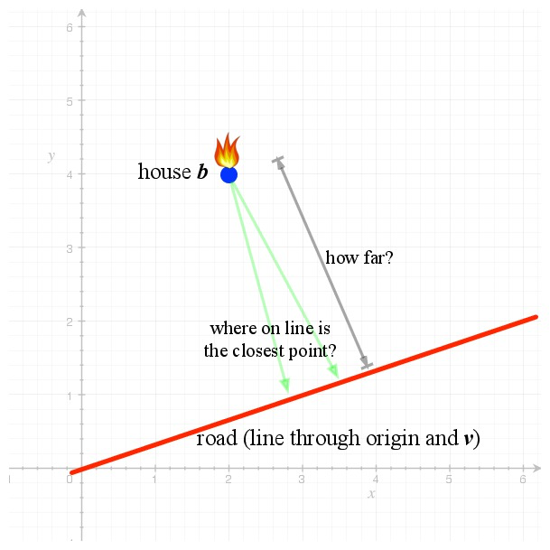
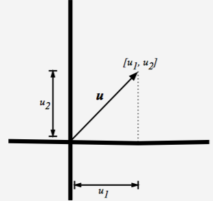
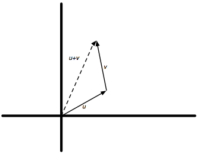
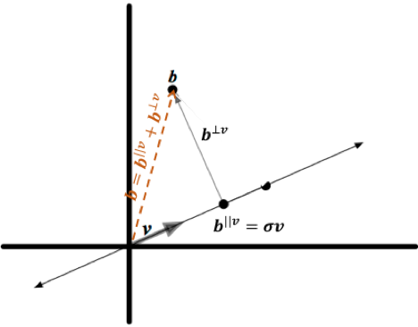

# Chap 09

# 내적 - Inner Product

이번 9장에서는 *길이* (length)와 *직교* (perpendicular)의 개념이 수학적 용어로 어떻게 해석되는지 알아본다. 어떤 점에 가장 가까운 주어진 직선상의 점을 찾는 문제에 대해 살펴본다. 


## 9.1 *소방차* 문제

아래의 그림에서 좌표 $[2,4]$ 에 위치한 집 $b$에 화재가 났다고 하자. 집 주변을 지나가는 도로는 원점과 점 $[6,2]$ 을 지나는 직선이면, 집 $b$와 가장 가까운 직선상의 어떤 지점으로 소방차를 위치 시킬 수 있으면 화재를 진압 시킬 수 있다고 하면, 두 가지를 생각할 수 있다.

- *직선상의 어느 점이 집 $b$와 가까운가?*
- *그렇다면, 가장 가까운 거리는 얼마나 되는가?*



이것을 계산문제로 재구성 해보자. 앞의 [3.5.3](https://render.githubusercontent.com/view/ipynb?commit=a1af54cf049c9501c8ae5d311e82ae796536b138&enc_url=68747470733a2f2f7261772e67697468756275736572636f6e74656e742e636f6d2f457863656c73696f72434a482f53747564792f613161663534636630343963393530316338616535643331316538326165373936353336623133382f4c696e656172416c67656272612f436f64696e675468654d61747269782f4368617030332532302d253230546865253230566563746f722f4368617030332d5468655f566563746f722e6970796e62&nwo=ExcelsiorCJH%2FStudy&path=LinearAlgebra%2FCodingTheMatrix%2FChap03+-+The+Vector%2FChap03-The_Vector.ipynb&repository_id=116745719&repository_type=Repository#3.5.3-%EC%9B%90%EC%A0%90%EC%9D%84-%EC%A7%80%EB%82%98%EB%8A%94-%EC%84%A0%EB%B6%84) 에서 처럼 원점을 지나는 직선은 벡터의 스칼라배들의 집합으로서 표현할 수 있다. 위의 그림에서 도로는 직선 $\{\alpha [3,1] : \alpha \in \mathbb{R} \}$ 로 나타낼 수 있다. 따라서, 위의 *소방차* 문제는 아래와 같이 구성할 수 있다.

***Computational Problem*** : 하나의 주어진 벡터에 가장 가까운 다른 하나의 주어진 벡터의 생성(Span) 내에 있는 벡터

- *input* : 벡터 $v$ 및 $b$
- *output* : $b$에 가장 가까운 직선 $\{ \alpha v : \alpha \in \mathbb{R} \}$ 상의 점


### 9.1.1 거리, 길이, norm, 내적

두 벡터 $p$ 와 $b$ 사이의 거리는 차분(difference) $p-b$ 로 정의한다. 이것은 벡터의 길이를 정의해야 한다는 것을 의미한다.(?) 벡터에 대해 "*길이* "라는 용어를 사용하는 대신에 보통 $norm$ 을 사용한다. 

벡터 $v$ 의 $norm$은 $||v||$ 로 표현한다. $norm$ 은 길이 역할을 하므로, 다음의 $norm$ 성질을 만족해야 한다.

- Property N1 : 임의의 벡터 $v$ 에 대해, $||v||$ 은 음이 아닌 실수이다.
- Property N2 : 임의의 벡터 $v$ 에 대해, $||v||$ 이 영($0$)이 될 필요충분조건은 $v$ 가 영벡터인 것이다.
- Property N3 : 임의의 벡터 $v$ 와 임의의 스칼라 $\alpha$ 에 대해, $||\alpha v|| = |\alpha| \cdot  ||v||$ 이다.
- Property N4 : 임의의 벡터 $u$ 와 $v$ 에 대해, $||u + v|| \le ||u|| + ||v||$  이다. 

벡터의 $norm$을 정의하는 한 가지 방법은 *내적* (inner product)라고 하는 벡터들에 대한 연산을 정의하는 것이다. 벡터 $u$ 와 $v$ 의 내적에 대한 표기법은 아래와 같다
$$
\left< u,v \right>
$$
내적은 어떠한 공리(axiom)들을 만족해야 하며, 이 공리들에 대해서는 나중에 살펴보도록 하자.

내적이 정의 되었으면, 벡터 $v$ 의 $norm$ 은 다음과 같이 정의된다.
$$
\left\| v \right\| =\sqrt { \left< v,v \right>  }
$$


## 9.2 실수 벡터들에 대한 내적

$\mathbb{R}$ 상의 벡터들에 대한 내적은 도트곱으로 정의된다.
$$
\left< u, v \right> = u \cdot v
$$

- *선형성* : $\left< u+v, w \right> = \left< u,w \right> + \left< v,w \right>$
- *대칭성* : $\left< u,v \right> = \left< v, u \right>$
- *동질성* : $\left< \alpha u, v \right> = \alpha \left< u,v \right>$ 


### 9.2.1 실수 벡터들의 $norm$

$norm$ 함수가 어떤 형태인지 살펴보자.
$$
\left\| v \right\| =\sqrt { \left< v,v \right>  }
$$
$v$ 는 $n$-벡터라 하고, $v=[v_1, …, v_n]$ 으로 표현하면,
$$
||v||^2 = \left< v, v \right> = v \cdot v
$$

$$
= v_{1}^2 + \cdots + v_{n}^2
$$

좀 더 일반적으로, 만야 $v$ 가 $D$-벡터이면,
$$
||v||^2 = \sum _{ i \in D }^{  }{ v_{i}^{2} }
$$
따라서 $||v|| = \sqrt{ \sum _{ i \in D }^{  }{ v_{i}^{2} } }$  이다. 

***Example 9.2.1*** : $2$-벡터의 예를 고려해 보자. 벡터 $u=[u_1, u_2]$ 의 길이는 무엇일까? 피타고라스 정리를 이용하면 아래와 같이 계산할 수 있다. 


$$
(u 의길이)^2 = u_1^2 + u_2^2
$$
따라서, 위와 같이 피타고라스 정리에 의한 길이계산은 $\mathbb{R}^2$ 의 벡터들에 대한 길이와 일치한다. 


## 9.3 직교성 - Orthogonality

*직교* (Orthogonal)는 *수직* (perpendicular)에 대한 수학적인 용어이다. 

직교의 정의에 대해 알아보기 전에 *피타고라스 정리* 를 역으로 사용하여 피타고라스 정리가 성립되도록 직교의 개념을 정의해보자.

$u$ 와 $v$ 는 벡터라고하자. 이 벡터들의 길이는 $||u||$ 와 $||v||$ 이다. 이 벡터들의 평행이동을 생각하여 $v$ 의 꼬리를 $u$의 머리에 놓자. 그러면 '빗변'은 $u$ 의 꼬리에서 $v$의 머리까지이며 $u+v$ 이다.



벡터 $u+v$ (빗변)의 제곱의 길이는 다음과 같다.
$$
\begin{eqnarray} ||u+v||^{ 2 } & = & \left< u+v,u+v \right>  \\  & = & \left< u,u+v \right> +\left< v,u+v \right>  \\  & = & \left< u,u \right> +\left< u,v \right> +\left< v,u \right> +\left< v,v \right>  \\  & = & { \left\| u \right\|  }^{ 2 }+2\left< u,v \right> +{ \left\| v \right\|  }^{ 2 } \end{eqnarray}
$$
마지막 표현이 $||u||^2+||v||^2$ 이 될 필요충분조건은 $\left< u,v \right> = 0$ 이 되는 것이다.

따라서, 만약 $\left< u,v \right> = 0$ 이면 $u$와 $v$ 는 *직교* 라고 정의한다. 

***Theorem(실수 벡터들에 대한 피타고라스 정리)*** : 만약 실수 벡터 $u$ 와 $v$ 가 직교하면 다음이 성립한다.
$$
||u+v||^2 = ||u||^2 + ||v||^2
$$


### 9.3.1 직교의 성질

***Lemma (Orthogonality Properties)*** : 임의의 벡터 $u$ 와 $v$ , 그리고 임의의 스칼라 $\alpha$ 에 대해,

- *Property O1* : 만약 $u$ 가 $v$ 와 직교하면 $\alpha u$ 는 모든 스칼라 $\alpha$ 에 대해 $\alpha v$ 와 직교한다.
- *Property O2* : 만약 $u$ 와 $v$ 둘 다 $w$ 와 직교하면 $u + v$ 는 $w$ 와 직교한다.
  - **Proof** :
  - i. $\left< u, \alpha v \right> = \alpha \left< u, v \right> = \alpha 0 = 0$
  - ii. $\left< u+v, w \right> = \left< u, w \right> + \left< v, w \right> = 0 + 0$ 


***Lemma*** : 만약 $u$ 가 $v$ 와 직교이면 임의의 스칼라 $\alpha, \beta$ 에 대해 다음이 성립한다.
$$
||\alpha u + \beta v||^2 = \alpha^2 ||u||^2 + \beta^2 ||v||^2
$$

- **Proof** :

$$
\begin{eqnarray} (\alpha u+\beta v)\cdot (\alpha u+\beta v) & = & \alpha u\cdot \alpha u+\beta v\cdot \beta v+\alpha u\cdot \beta v+\beta v\cdot \alpha u \\  & = & \alpha u\cdot \alpha u+\beta v\cdot \beta v+\alpha \beta (u\cdot v)+\beta \alpha (v\cdot u) \\  & = & \alpha u\cdot \alpha u+\beta v\cdot \beta v+0+0 \\  & = & \alpha^2 ||u||^2 + \beta^2 ||v||^2 \end{eqnarray}
$$


### 9.3.2 평행 및 수직 성분으로 벡터 분해

***Definition*** : 임의의 벡터 $b$ 와 $v$ 에 대해, 만약 다음이 성립하면 벡터 $b^{||v}$ 와 $b^{\bot v}$ 은 각각 *$b$ 의 $v$ 를 따른 투영(projection)* 과  *$b$  의 $v$ 에  직교하는 투영* 이라 정의한다.
$$
b = b^{||v} + b^{\bot v}
$$
여기서, 어떤 스칼라 $\alpha \in \mathbb{R}$ 에 대해, $b^{||v} = \sigma v$ 이고, $b^{\bot v}$ 은 $v$ 에 직교한다. 




### 9.3.3 *소방차* 문제에 대한 해의 직교 성질

***Lemma (Fire Engine Lemma)*** : $b$ 와 $v$ 는 벡터라고 하면, $b$ 에 가장 가까운 Span $\{v\}$ 내의 점은 $b^{||v}$ 이고, 그 거리는 $||b^{\bot v}||$ 이다.

- **Proof** : 


- $p$ 는 $L =$ Span $\{v\}$ 상의 임의의 점이라 하자. 세 점 $p, b^{||v}, b$ 는 삼각형을 형성한다. $p$ 에서 $b^{||v}$ 로의 화살표는 $b^{||v}-p$ 이다. $b^{||v}$ 에서 $b$ 로의 화살표는 $b-b^{||v}$ 이며 이것은 $b^{\bot v}$ 이다. $p$ 에서 $b$ 로의 화살표는 $b-p$ 이다.
- $b^{||v}$ 와 $p$ 는 둘 다 $L$ 상에 있으므로, 이 둘은 $v$ 의 배수이고, 이 둘의 차분인 $b^{||v}-p$  또한 $v$ 의 배수이다. $b-b^{||v}$ 은 $v$ 와 직교하므로 이것은 9.3.1의 Orthogonality Property Lemma에 의해 $b^{||v}-p$ 와 또한 직교한다. 이를 피타고라스 정리에 의하면 다음이 성립한다.

$$
||b-p||^2 = ||b^{||v} - p||^2 + ||b- b^{||v}||^2
$$

- 만약 $p \neq b^{||v}$ 이면 $||b^{||v}-p||^2 > 0$ 이고, 따라서 $|| b - b^{||v} || < ||b - p||$ 이다.


### 9.3.4 투영 및 가장 가까운 점 찾기

위의 9.3.3 의 그림에서 $\left< b^{\bot v}, v \right> = 0$ 이다. $b^{\bot v} = b - b^{||v}$ 이므로 $\left< b^{\bot v}, v \right> = \left< b-b^{||v}, v \right> = 0$ 이다. 또한, $b^{||v} = \sigma v$ 이므로 $\left< b^{\bot v}, v \right> = \left< b-b^{||v}, v \right> = \left< b-\sigma v, v \right> = 0$ 이다. 이를 다음과 같이 표현할 수 있다.
$$
\left< b, v \right> - \sigma \left< v, v \right> = 0
$$
$\sigma$에 대해 풀면 다음과 같다.
$$
\sigma = \frac{\left< b, v \right>}{\left< v, v \right>}
$$
$||v||=1$ 인 경우, 다음과 같다. 
$$
\sigma = \left< b, v \right>
$$
***Lemma*** : 임의의 실수 벡터 $b$ 와 $v$ 에 대해,

- $b - \sigma v$ 가 $v$ 에 직교하는 $\sigma$ 가 존재한다.
- Span $\{v\}$ 상에 있으며, $||b-p||$ 를 최소화하는 점 $p$ 는 $\sigma v$ 이다.
- $\sigma$ 의 값은 $\frac{\left< b, v \right>}{\left< v, v \right>}$ 이다.


파이썬 코드를 이용해 $v$ 의 생성(Span)에 대한 $b$ 의 투영(projection)을 반환하는 함수를 구현해보자. 아래 코드에서 `1e-20` 부분은 벡터 $v$가 아주 작은값(여기서는 $10^{-20}$) 보다 작거나 같으면 $v$ 는 영벡터라고 간주해주기 위한 부분이다.

```python
def project_along(b, v):
    bv = 0
    vv = 0
    for u, w in zip(b, v):
        bv += u*w
    for u,w in zip(v, v):
        vv += u*w
    
    sigma = (bv / vv) if vv > 1e-20 else 0
    return [sigma*e for e in v]

>>> b = [2, 4]
>>> v = [6, 2]
>>> project_along(b, v)
[3.0, 1.0]
```


### 9.3.5 *소방차* 문제에 대한 솔루션

이제 9.1에서 봤던 소방차 문제에 대한 그림을 다시 보자.


이 문제에서 $v = [6, 2]$ 이고, $b=[2, 4]$ 이다. 직선 $\{\alpha v : \alpha \in \mathbb{R} \}$ 위에 있는 가장 가까운 점은 $\sigma v$ 이며, $\sigma$ 는 다음과 같다.
$$
\begin{eqnarray} \sigma  & = & \frac { v\cdot b }{ v\cdot v }  \\  & = & \frac { 6\cdot 2+2\cdot 4 }{ 6\cdot 6+2\cdot 2 }  \\  & = & \frac { 20 }{ 40 }  \\  & = & \frac { 1 }{ 2 }  \end{eqnarray}
$$
따라서, $b$ 에 가장 가까운 점은 $\frac{1}{2} [6, 2] = [3, 1]$ 이다. $b$ 까지의 거리는 $||[2,4]-[3,1]|| = ||[-1, 3]|| = \sqrt{10}$ 이다.


### 9.3.6 외적(Outer product)과 투영

벡터 $u​$ 와 $v​$ 의 *외적* 은 행렬-행렬 곱 $uv^{T}​$ 으로 정의된다.
$$
\begin{bmatrix}  \\ u \\  \end{bmatrix}\begin{bmatrix}  & v^{ T } &  \end{bmatrix}
$$

