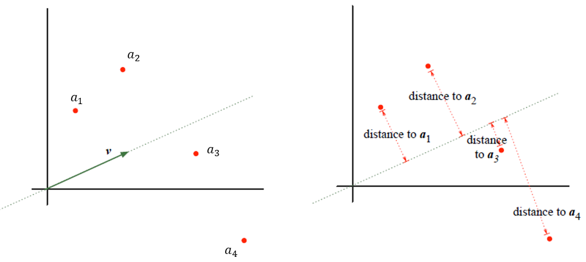
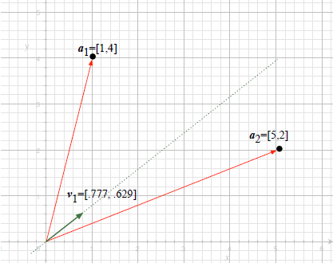
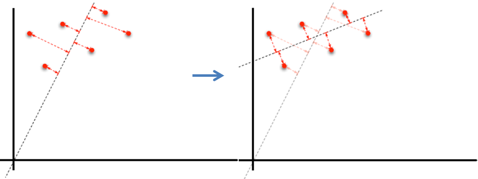
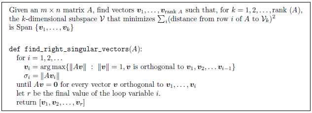

# Chap12

# 특이값 분해(Singular Value Decomposition)


## 12.1 로우-랭크(Low-rank) 행렬에 의한 행렬의 근사

### 12.1.1 로우-랭크 행렬의 이점

Low-rank Assumption은 *'어떤 행렬 $M$ 을 $M$ 보다 더 작은 $rank$ 를 가지는 행렬의 곱으로 표현이 가능하다'* 라는 것을 의미한다.  예를 들어, $rank$ 가 1인 행렬을 생각해 보자. 모든 행들은 1차원 공간에 놓여 있으며, $\{v\}$ 는 이 공간에  대한 기저라고 하자. 행렬의 모든 행은 $v$ 의 스칼라배이다. $u$ 를 이러한 스칼라배들의 벡터라고 하면, 이러한 행렬을  $uv^{T}$ 로 나타낼 수 있다. 이러한 표현으로 작은 저장공간으로 행렬을 나타낼 수 있으므로 로우-랭크 행렬의 이점이라 할 수 있다. 즉, 아래의 식과 같이 랭크 $1$ 인 $m \times n$ 행렬에 대해 단지 $m+n$ 개의 숫자들로 구성할 수 있다.  


$$
\begin{bmatrix} 1 \\ 2 \\ 3 \end{bmatrix}{ \begin{bmatrix} 1 \\ 2 \\ 3 \end{bmatrix} }^{ T }=\begin{bmatrix} 1 \\ 2 \\ 3 \end{bmatrix}\begin{bmatrix} 1 & 2 & 3 \end{bmatrix}=\begin{bmatrix} 1 & 2 & 3 \\ 2 & 4 & 6 \\ 3 & 6 & 9 \end{bmatrix}
$$
마찬가지로, 랭크가 $2$인 행렬은 다음과 같이 표현할 수 있다.


$$
\begin{bmatrix} | & | \\ u_{ 1 } & u_{ 2 } \\ | & | \end{bmatrix}\begin{bmatrix} - & v_{ 1 }^{ T } & - \\ - & v_{ 2 }^{ T } & - \end{bmatrix}
$$
그러나, 실제 데이터에서는 행렬 대부분은 로우-랭크가 아니다. 하지만, 종종 로우-랭크의 근사행렬이 거의 원래 행렬 만큼이나 잘 동작한다고 한다. 

이번 장에서는 주어진 행렬에 대한 최적의 랭크-$k$ 행렬을 찾는 방법에 대해 알아 보도록 한다. 이때의 랭크-$k$ 행렬은 주어진 행렬에 가장 가까운 행렬이다. 


### 12.1.2 행렬의 $Norm$

주어진 행렬에 가장 가까운 랭크-$k$ 행렬을 찾는 문제를 정의하기 위해 행렬들에 대한 거리를 정의하는 것이 필요하다. 벡터들의 경우, 거리는 $norm$ 으로 주어지고, $norm$ 은 내적으로 정의된다. $\mathbb{R}$ 상의 벡터들에 대한 내적은 도트곱이고, 벡터의 $norm$ 은 그 원소들의 제곱의 합의 제곱근이다. 

행렬의 $norm$은 행렬 $A$ 를 벡터로 해석함으로써 계산할 수 있다. $m \times n$ 행렬은 $mn$-벡터로 표현할 수 있다. 

아래와 같이 행렬 $A$ 의 $norm$을 계산하는 것을 *프로베니우스(Frobenius)* $norm$ 이라고 한다.


$$
\left\| A \right\| _{ F }=\sqrt { \sum _{ i }^{  }{ \sum _{ j }^{  }{ A\left[ i,j \right] ^{ 2 } }  }  }
$$
***Lemma*** : $A$의 프로베니우스 $norm$ 의 제곱은 $A$ 의 행들의 제곱의 합과 동일하다.

- **Proof** : $A$ 는 $m \times n$ 행렬이라 하고, $A$ 를 행벡터로 나타내자.  

$$
A=\begin{bmatrix} - & a_{ 1 } & - \\  & \vdots  &  \\ - & a_{ m } & - \end{bmatrix}
$$

- 각각의 행-$i$ 에 대해, 다음과 같이 나타낼 수 있다.

$$
\left\| a_i  \right\| ^{ 2 } = a_i[1]^2 + a_i[2]^2 + \cdots + a_i[n]^2
$$

- 이 식을 프로베니우스 $norm$ 의 식에 대입하면 다음과 같다.

$$
\begin{eqnarray} \left\| A \right\| _{ F } & = & (A[1,1]^{ 2 }+A[1,2]^{ 2 }+\cdots +A[1,n]^{ 2 })+\cdots +(A[m,1]^{ 2 }+A[m,2]^{ 2 }+\cdots +A[m,n]^{ 2 }) \\  & = & \left\| a_{ 1 } \right\| ^{ 2 }+\cdots +\left\| a_{ m } \right\| ^{ 2 } \end{eqnarray}
$$


파이썬의 [`numpy.linalg.norm()`](https://docs.scipy.org/doc/numpy-1.14.0/reference/generated/numpy.linalg.norm.html) 에서는 다양한 $norm$ 계산을 제공하는데 물론 프로베니우스 $norm$ 도 제공한다. 아래의 코드는 `numpy` 모듈을 이용한 프로베니우스 $norm$ 을 구하는 코드이다. 

```python
import numpy as np

A = np.matrix([[1, 0],
               [0, 1]])

fro_norm = np.linalg.norm(A, 'fro')
print(fro_norm)

'''출력결과
1.4142135623730951
'''
```


## 12.2 *트롤리 노선 위치 (Trolley-line-location)* 문제

[9.1 소방차 문제](https://render.githubusercontent.com/view/ipynb?commit=af2d6b76f2034fb89db4a7e8ecc341384cfc48c7&enc_url=68747470733a2f2f7261772e67697468756275736572636f6e74656e742e636f6d2f457863656c73696f72434a482f436f64696e675468654d61747269782f616632643662373666323033346662383964623461376538656363333431333834636663343863372f4368617030392532302d253230546865253230496e6e657225323050726f647563742f4368617030392d5468655f496e6e65725f50726f647563742e6970796e62&nwo=ExcelsiorCJH%2FCodingTheMatrix&path=Chap09+-+The+Inner+Product%2FChap09-The_Inner_Product.ipynb&repository_id=125392345&repository_type=Repository#9.1-%EC%86%8C%EB%B0%A9%EC%B0%A8-%EB%AC%B8%EC%A0%9C) 와 비슷하게 아래의 그림과 같이 벡터 $a_1, ..., a_m​$ 으로 표현된 $m​$개의 주택의 위치에 대해, 트롤리 노선을 어디에다 위치할 것인지를 찾는 문제를 생각해보자.  




이 문제의 목적은 트롤리 노선을 $m$ 개의 주택에 가능한 가깝게 배치하는 것이다. 

각 벡터 $a_i$ 는 트롤리 노선으로 부터 자신까지의 거리 $d_i$ 를 가진다. 즉, 벡터 $[d_1, ..., d_m]$ 의 $norm$ 을 최소화 해햐한다. 이 문제는 벡터 $norm$ 의 제곱, $d_{1}^{2} + \cdots + d_{m}^{2}$ 을 최소화하는 것과 동일하다.


### 12.2.1 트롤리 노선 위치 문제에 대한 솔루션

각 벡터 $a_i$에 대해, $a_i = a_{i}^{||v} + a_{i}^{\perp v}$ 라고 나타낼 수 있으며 ($a_{i}^{||v}$ 는 $v$ 에 따른 $a_i$의 투영, $a_{i}^{\perp v}$ 는 $v$ 에 직교하는 투영) 다음과 같이 쓸 수 있다. 단, 여기서 $v$는 $Span\{v\}$를 형성하는 단위 $norm$ 벡터($norm=1$)이다.
$$
a_{1}^{\perp v} = a_1 - a_{1}^{||v}
$$

$$
\vdots
$$

$$
a_{m}^{\perp v} = a_m - a_{m}^{||v}
$$

피타고라스 정리에 의하면, 다음이 성립한다.
$$
\left\| a_{1}^{\perp v} \right\|^{2}=\left\| a_1 \right\|^{2} -\left\| a_{1}^{||v} \right\|^{2}
$$

$$
\vdots
$$

$$
\left\| a_{m}^{\perp v} \right\|^{2}=\left\| a_m \right\|^{2} -\left\| a_{m}^{||v} \right\|^{2}
$$

$a_{i}^{\perp v}$ 는 $a_i$ 에서 $Span \{v\}$ 까지의 거리이므로, 다음과 같이 나타낼 수 있다.
$$
(a_1에서 Span\{v\}까지의 거리)^2 =\left\| a_1 \right\|^{2} -\left\| a_{1}^{||v} \right\|^{2}
$$

$$
\vdots
$$

$$
(a_m에서 Span\{v\}까지의 거리)^2=\left\| a_m \right\|^{2} -\left\| a_{m}^{||v} \right\|^{2}
$$

위의 식을 수직으로 더하면 다음과 같다.
$$
\begin{eqnarray} \sum _{ i }^{  }{ (a_{ i }에서Span\{ v\} 까지의거리)^{ 2 } }  & = & \left\| a_{ 1 } \right\| ^{ 2 }+\cdots +\left\| a_{ m } \right\| ^{ 2 }-\left( \left\| a_{ 1 }^{ ||v } \right\| ^{ 2 }+\cdots +\left\| a_{ m }^{ ||v } \right\| ^{ 2 } \right)  \\  & = & \left\| A \right\|_{F} ^{2}  - \left( \left\| a_{1}^{||v} \right\|^2 +\cdots +  \left\| a_{m}^{||v} \right\|^2   \right) \end{eqnarray}
$$


위의 12.1.2의 *Lemma* 에 의하면 $A$는 행들이 $a_1,...,a_m$ 인 행렬이다.

$v$ 는 $norm$이 1인 벡터이며,  $a_{i}^{||v} = \left< a_i, v \right>$ 이므로 $\left\| a{i}^{||v} \right\|^{2} = \left< a_i, v \right>^{2}$ 이다. 이를 이용하여 다음과 같이 나타낼 수 있다.
$$
\sum _{ i }^{  }{ (a_{ i }에서Span\{ v\} 까지의거리)^{ 2 } } = \left\| A \right\|_{F} ^{2} - \left( \left< a_1, v \right>^{2} +\left< a_2, v \right>^{2} + \cdots + \left< a_m, v \right>^{2} \right)
$$
$ \left( \left< a_1, v \right>^{2} +\left< a_2, v \right>^{2} + \cdots + \left< a_m, v \right>^{2} \right)$ 는 아래와 같이 $\left\| Av \right\| ^{2}$ 로 나타낼 수 있다.
$$
\begin{bmatrix} - & a_{ 1 } & - \\  & \vdots  &  \\ - & a_{ m } & - \end{bmatrix} \begin{bmatrix}  \\  \\ v \\  \\  \end{bmatrix}=\begin{bmatrix} \left< a_{ 1 },v \right>  \\ \vdots  \\ \left< a_m, v \right>  \end{bmatrix}
$$

$$
\left\| Av \right\| ^{2} = \left( \left< a_1, v \right>^{2} +\left< a_2, v \right>^{2} + \cdots + \left< a_m, v \right>^{2} \right)
$$

최종적으로 아래와 같은 식을 구할 수 있다.
$$
\sum _{ i }^{  }{ (a_{ i }에서Span\{ v\} 까지의거리)^{ 2 } } =\left\| A \right\|_{F} ^{2}  -\left\| Av \right\| ^{2}
$$
따라서, 최적의 벡터 $v$ 는 $\left\| Av \right\| ^{2}$ 를 **최대화**하는 (즉, $\left\| Av \right\|$ 를 최대화하는) 단위벡터이다.  

이를 이용하여 트롤리 노선문제에 대한 솔루션은 다음과 같이 pseudo-code로 나타낼 수 있다.

| 트롤리 노선 문제 솔루션                                      |
| :----------------------------------------------------------- |
| def trolley_line_location($A$):<br />        Given a matrix $A$, find the vector $v_1$<br />        minimizing $\sum _{ i }^{  }{ (a_{ i }에서Span\{ v\} 까지의거리)^{ 2 } }$ <br />        $v_1 = \arg \max \{\left\| Av \right\| : \left\| v \right\| = 1\}$ <br />        $\sigma_{1} = \left\| Av_{1} \right\|$ <br />        return $v_1$ |

$\arg \max$ 표기법은 $\left\| Av \right\|$ 의 값이 최대가 되게 하는 것(이 경우 $norm$ 이 1인 벡터 $v$)을 의미한다.  이번 장에서는 솔루션을 제시하고 13장에서 $v_1$을 근사하는 방법에 대해 공부한다.


***Definition*** : $\sigma_1$ 은 $A$의 *첫 번째 특이값(singular value)* 이라 하고, $v_1$ 은 *첫 번째 오른쪽 특이벡터* 라 한다.


***Example 12.2.3*** : $A=\begin{bmatrix} 1 & 4 \\ 5 & 2 \end{bmatrix}$ 라고 하면, 행렬 $A$의 행벡터 $a_1, a_2$는 $a_1 = [1, 4], a_2 = [5, 2]$ 이다. 이 경우, $\left\| Av \right\|$ 을 최대가 되게하는 단위벡터는 $v_1 \approx \begin{bmatrix} 0.78 \\ 0.63 \end{bmatrix}$ 이다. $\sigma_1 = \left\| Av \right\|$ 은 $6.1$ 이다.




***Theorem*** : $A$ 는 $\mathbb{R}$ 상의 $m \times n$ 행렬이고, 이 행렬의 행들은 $a_1, ..., a_m$ 이라 하자. 이때 $v_1$ 은 $A$ 의 첫 번째 오른쪽 특이벡터라고 하면, $Span \{v_1\}$ 은 다음을 최소화하는 1차원 벡터공간 $\mathcal{V}$ 이다.
$$
(a_1에서 \mathcal{V}까지의 거리)^{2} + \cdots + (a_m 에서 \mathcal{V} 까지의 거리)^{2}
$$


***Lemma*** : 제곱 거리(squared distances)의 합의 최소값은 $\left\| A \right\|_{F} ^{2}  -\left\| Av \right\| ^{2}$ 이다.


*12.2.3 생략*

### 12.2.3 최상의 랭크-1 근사

위의 트롤리 노선 위치 문제에 대한 솔루션을 기반으로 하여 *주어진 행렬에 대한 최상의 랭크-1 근사를 찾는 문제* 에 대한 솔루션을 구해보자. 먼저, *랭크-1 근사* 문제를 정의하자.

| *Rank-one approximation*                                     |
| ------------------------------------------------------------ |
| - *input* : 영이 아닌 행렬 $A$ <br />- *output* : 프로베니우스 $norm$ 에 따라 $A$ 에 가장 가까운 랭크-1 행렬 $\tilde { A }$ |

 목적은 $\left\| A - \tilde{A} \right\|_{F}$ 을 최소화하는 랭크-1 행렬 $\tilde{A}$를 찾는 것이다.
$$
\tilde{A} = \arg \min \{ \left\| A- B \right\|_{F} : B 는 랭크1을 가진다 \}
$$
어떤 랭크-1 행렬 $\tilde{A}$ 가 있다고 하면, 이 행렬은 $A$ 에 얼마나 가까운가? $A$ 와 $\tilde{A}$ 사이의 제곱 거리를 다음과 같이 나타낼 수 있다.
$$
\left\| A - \tilde{A} \right\|_{F}^{2}  = \left\| A - \tilde{A} 의 행 1\right\|^{2} +\cdots + \left\| A - \tilde{A} 의 행 m\right\|^{2}
$$
위의 식이 의미하는 바는, $A$에 대한 거리를 최소화하기 위해서는 $\tilde {A}$ 의 각 행이 $A$ 의 대응하는 행에 가능한한 가깝도록 되게 선택되어야 한다는 것을 말한다. 또한, $\tilde {A}$는 랭크가 $1$ 이어야 한다. 즉, 어떤 벡터 $v$ 에 대해, $\tilde{A}$의 각 행은 $Span\{v\}$ 내에 있어야 한다.
$$
\tilde{A} =\begin{bmatrix} - & a_{ 1 }에 가장가까운 Span\{v\}내의 벡터 & - \\  & \vdots  &  \\ - &  a_{ m }에 가장가까운 Span\{v\}내의 벡터& - \end{bmatrix}
$$
따라서, $i=1,...,m$ 에대해, 다음과 같이 나타낼 수 있다.
$$
 \left\| A - \tilde{A} 의 행 i\right\| = a_i 에서 Span\{v\}까지의 거리
$$

$$
\left\| A - \tilde{A} \right\|^{2}  =(a_1에서 Span\{v\}까지의 거리)^{2} + \cdots + (a_m 에서 Span\{v\} 까지의 거리)^{2}
$$


### 12.2.4 최상의 랭크-1 근사에 대한 표현

위의 식을 표현하는 더 나은 방법이 있다. $v$를 *첫번째 오른쪽 특이벡터* $v_1$ 이라 하고 $a_i$ 에 가장 가까운 $Span\{v_1\}$의 벡터는 $a_{i}^{||v_{1}}$ 이며, 이것은 $a_i$의 $Span\{v_{1}\}$ 상으로의 투영이다. 식 $a_{i}^{||v_{1}} = \left< a_i, v_1 \right>v_1$을 사용하여 다음과 같이 나타낼 수 있다.


$$
\tilde{A} =\begin{bmatrix} - & \left< a_1, v_1 \right> v_{1}^{T} & - \\  & \vdots  &  \\ - & \left< a_m, v_1 \right> v_{1}^{T} & - \end{bmatrix}
$$
벡터-행렬 곱셈의 선형결합 해석을 사용하여 두 벡터의 외적으로 나타낼 수 있다.
$$
\tilde{A} = \begin{bmatrix} \left< a_{ 1 },v \right>  \\ \vdots  \\ \left< a_m, v \right>  \end{bmatrix} \begin{bmatrix}  & & v_{1}^{T} &  & \end{bmatrix}
$$

$$
\tilde{A} =\begin{bmatrix}  \\  \\ Av_{1} \\  \\  \end{bmatrix} \begin{bmatrix}  & & v_{1}^{T} &  & \end{bmatrix}
$$

$\sigma_1 = \left\| Av_{1} \right\|$ (첫번째 왼쪽 특이값) 라고 하고, $u_1$은 $\sigma_1 u_1 = Av_1$을 만족하는 $norm$-1 벡터라고 하면 다음과 같이 쓸 수 있다.
$$
\tilde {A} = \sigma_1\begin{bmatrix}  \\  \\ u_{1} \\  \\  \end{bmatrix} \begin{bmatrix}  & & v_{1}^{T} &  & \end{bmatrix}
$$


***Definition*** : $A$ 의 *첫 번째 왼쪽 특이벡터(left singular vector)* 는 $\sigma_1 u_1 = A v_1$을 만족하는 벡터 $u_1$ 이다. 여기서, $\sigma_1$ 은 $A$의 첫 번째 특이값이고 $v_1$은 첫 번째 오른쪽 특이벡터이다.


***Theorem*** : $A$에 대한 최상의 랭크-1 근사는 $\sigma_1 u_1 v_{1}^{T}$ 이다. 여기서 여기서, $\sigma_1$ 은 $A$의 첫 번째 특이값이고, $u_1$ 은 첫 번째 왼쪽 특이벡터이며, $v_1$은 첫 번째 오른쪽 특이벡터이다.


***Example 12.2.12*** : Example 12.2.3 에서 보았듯이, 행렬 $A=\begin{bmatrix} 1 & 4 \\ 5 & 2 \end{bmatrix}$에 대해, 첫 번째 오른쪽 특이벡터는 $v_1 \approx \begin{bmatrix} 0.78 \\ 0.63 \end{bmatrix}$ 이고, 첫 번째 특이값 $\sigma_1$ 은 약 6.1이다. 첫 번째 왼쪽 특이벡터는 $u_1 \approx \begin{bmatrix} 0.54 \\ 0.84 \end{bmatrix}$ 이며, 이것은 $\sigma_1 u_1 = Av_1$ 임을 의미한다.
$$
\begin{eqnarray} \tilde { A }  & = & \sigma _{ 1 }u_{ 1 }v_{ 1 }^{ T } \\  & \approx  & 6.1\begin{bmatrix} 0.54 \\ 0.84 \end{bmatrix}\begin{bmatrix} 0.78 & 0.63 \end{bmatrix} \\  & \approx  & \begin{bmatrix} 2.6 & 2.1 \\ 4.0 & 3.2 \end{bmatrix} \end{eqnarray}
$$

$$
\begin{eqnarray} A-\tilde { A }  & = & \begin{bmatrix} 1 & 4 \\ 5 & 2 \end{bmatrix}-\begin{bmatrix} 2.6 & 2.1 \\ 4.0 & 3.2 \end{bmatrix} \\  & \approx  & \begin{bmatrix} -1.56 & 1.93 \\ 1.00 & -1.23 \end{bmatrix} \end{eqnarray}
$$

따라서, $A-\tilde{A}$ 의 제곱 프로베니우스 $norm$은 아래와 같다.
$$
1.56^2 + 1.93^2 + 1^2 + 1.23^2 \approx 8.7
$$


### 12.2.5 가장 가까운 1차원 아핀공간

12.2에서 트롤리 노선 문제를 정의할 때, 트롤리 노선은 원점을 지나간다고 규정하였다. 이러한 규정을 정의한 이유는 트롤리 노선 문제를 가장 가까운 1차원 *벡터공간* 을 찾는 문제에 대응시키기 위함이었다. 이러한 1차원 벡터공간은 원점을 지나는 직선이다. [4.5](https://render.githubusercontent.com/view/ipynb?commit=e264e1dd3f61775cabdbb31b290e56feec5ccc73&enc_url=68747470733a2f2f7261772e67697468756275736572636f6e74656e742e636f6d2f457863656c73696f72434a482f436f64696e675468654d61747269782f653236346531646433663631373735636162646262333162323930653536666565633563636337332f4368617030342532302d253230546865253230566563746f7225323053706163652f4368617030342d5468655f566563746f725f53706163652e6970796e62&nwo=ExcelsiorCJH%2FCodingTheMatrix&path=Chap04+-+The+Vector+Space%2FChap04-The_Vector_Space.ipynb&repository_id=125392345&repository_type=Repository#4.5.1-%EC%9B%90%EC%A0%90%EC%9D%84-%EC%A7%80%EB%82%98%EC%A7%80-%EC%95%8A%EB%8A%94-flat)에서 배운 *아핀공간* 정의에 의하면 임의의 직선(반드시 원점을 지날 필요는 없음)은 *아핀공간(Affine space)* 이다.

트롤리 노선 문제 솔루션을 적용하여 *가장 가까운 1차원 아핀공간* 을 찾을 수 있다. 주어진 점 $a_1,...,a_m$ 에 대해, 점 $\bar {  a}$ 를 선택하교, 다음에 $\bar{a}$를 빼주어 각 입력 점들을 평행이동하면 다음과 같다.
$$
a_1 - \bar{a},...,a_m-\bar{a}
$$
이러한 평행이동된 점들에 가장 가까운 1차원 벡터공간을 찾고, 그 다음에 $\bar{a} $ 를 더하여 찾은 벡터공간을 평행이동한다. 즉 주어진 점 $a_1,..,a_m$을 $\bar{a}$ 만큼 빼주어 평행이동 시킨다음 *원점을 지나는* 가장 가까운 1차원 벡터공간을 찾고, 그리고 다시 $\bar{a}$ 만큼 평행이동 한 것이 바로 가장 *가까운 아핀공간* 이 된다. 이러한 가장 가까운 아핀공간을 찾는것은 어떠한 $\bar{a}$ 를 설정하느냐에 따라 다르다. $\bar{a}$의 가장 최상의 선택은 입력 점들 $a_1,...,a_m$의 *센트로이드(centroid)* 이다.
$$
\bar{a} = \frac{1}{m} (a_1+\cdots + a_m)
$$
주어진 점들의 센트로이드를 찾은 다음, 그 센트로이드를 빼주어 주어진 점들을 평행이동하는 것을 점들에 대한 *센터링(centering)* 이라고 한다.




## 12.3 가장 가까운 차원 - $k$ 벡터공간

12.2의 트롤리 노선 위치 문제를 더 높은 차원으로 일반화하면 다음과 같다.

| *closest low-dimensional subspace* :                         |
| ------------------------------------------------------------ |
| - *input* : 벡터 $a_1,...,a_m$ 과 양의 정수 $k$ <br />- *output* : 다음을 최소화 하는 $k$-차원 벡터공간 $\mathcal{V}_{k}$에 대한 기저 $ \rightarrow \sum _{ i }^{  }{ (a_{ i }에서 \mathcal{V}_{k} 까지의거리)^{ 2 } } $ |

트롤리 노선 문제는 $k=1$ 인 단순히 특수한 경우이며, 1차원 벡터공간에 대한 기저를 찾는다.


### 12.3.1 특이값 및 특이벡터를 찾는  $Gedanken$ 알고리즘

이 알고리즘의 일반화는 *정규직교* 기저를 찾는 것이다. 이터레이션 $i$ 에서, 선택된 벡터 $v$ 는 $\left\| Av \right\| $ 을 최대가 되게 하는 것이며, 이 벡터는 이전에 선택된 모든 벡터들에 직교한다.

- $v_1$은 $\left\| Av \right\|$ 을 최대가 되게 하는 $norm$-1 벡터 $v$
- $v_2$는 $v_1$에 직교하며 $\left\| Av \right\|$ 을 최대가 되게하는 $norm$-1 벡터 $v$
- $v_3$은 $v_1$ 및 $v_2$에 직교하며 $\left\| Av \right\|$을 최대가 되게하는 $norm$-1 벡터 $v$
- $\vdots$

다음은 이 알고리즘에 대한 의사코드이다.




***Definition*** : 벡터 $v_1, v_2 ,..., v_r$ 은 $A$의 *오른쪽 특이벡터* 이고, 대응하는 실수 $\sigma_1, \sigma_2, ..., \sigma_r$ 은 $A$의 *특이값* 들이다.


### 12.3.2 특이값 및 오른쪽 특이벡터들의 성질

위의 12.3.1 에서 다음과 같은 성질을 알 수 있다.

***Proposition*** : 오른쪽 특이벡터들은 *정규직교(orthonormal)* 한다.

***Example 12.3.4*** : Example 12.2.3 과 12.2.6 의 행렬 $A=\begin{bmatrix} 1 & 4 \\ 5 & 2 \end{bmatrix}$를 다시 보자. 첫 번째 오른쪽 특이벡터는 $v_1 \approx \begin{bmatrix} 0.78 \\ 0.63 \end{bmatrix}$ 이고, 첫 번째 특이값 $\sigma_1 \approx 6.1$ 이다. 두 번째 오른쪽 특이벡터는 $\begin{bmatrix} 0.78 \\ 0.63 \end{bmatrix}$에 직교하는 벡터들 중에서 선택되어야 한다. 따라서, 두번째 오른쪽 특이벡터는 $\begin{bmatrix} 0.63 \\ -0.78 \end{bmatrix}$ 이고 대응하는 특이값 $\sigma_2 \approx 2.9$ 이다.

벡터 $v_1$ 과 $v_2$는 직교한다. 위의 예제에서 $\sigma_2 < \sigma_1$ 인 이유는 두 번째 최대화는 더 작은 후보 집합에 대해 수행되므로 첫 번째 값보다 더 클 수 없다.

벡터 $v_1$ 과 $v_2$ 는 직교하고 영이 아니므로, 두 벡터는 선형독립이고 $\mathbb{R}^2$ 를 생성한다.


***Proposition*** : 특이값들은 음수가 아니며 *내림차순(descending order)* 이다. 

- **Proof** : 각 특이값은 벡터의 $norm$이므로 음수가 될 수 없다. 각 $i > 1$ 에 대해, $v_i$ 가 선택되는 벡터들의 집합은 $v_{i-1}$ 이 선택된 벡터들의 집합의 부분집합이다. 따라서, 이터레이션 $i$에서의 최대값은 이터레이션 $i-1$ 에서의 최대값 보다 클 수 없다. 즉, $\sigma_i \le \sigma_{i-1}$ 이다.


***Lemma*** : $A$ 의 모든 행은 *오른쪽 특이벡터의 생성* 에 속한다.

- **Proof** : $\mathcal{V} = Span \{v_1,...,v_r\}$ 이라 하자. $\mathcal{V}^{o}$는 $\mathcal{V}$ 의 소멸자(annihilator)라고 하고, $\mathcal{V}^{o}$는 $\mathcal{V}$에 직교하는 벡터들로 구성된다([10.6.4 참고](https://render.githubusercontent.com/view/ipynb?commit=e264e1dd3f61775cabdbb31b290e56feec5ccc73&enc_url=68747470733a2f2f7261772e67697468756275736572636f6e74656e742e636f6d2f457863656c73696f72434a482f436f64696e675468654d61747269782f653236346531646433663631373735636162646262333162323930653536666565633563636337332f4368617031302532302d2532304f7274686f676f6e616c697a6174696f6e2f4368617031302d4f7274686f676f6e616c697a6174696f6e2e6970796e62&nwo=ExcelsiorCJH%2FCodingTheMatrix&path=Chap10+-+Orthogonalization%2FChap10-Orthogonalization.ipynb&repository_id=125392345&repository_type=Repository#10.6.4-%EC%A7%81%EA%B5%90%EC%97%AC%EA%B3%B5%EA%B0%84,-%EC%98%81%EA%B3%B5%EA%B0%84,-%EC%86%8C%EB%A9%B8%EC%9E%90)). $\mathcal{V}^{o}$ 에 속하는 임의의 벡터 $v^o$ 에 대해 곱 $Av^o$는 영벡터이다. 따라서, $A$의 행들은 $v^o$에 직교한다. 이 의미는 $(\mathcal{V}^{o})^{o} = \mathcal{V}$ 이므로 $A$ 의 행들이 $\mathcal{V}$에 속한다는 것을 보여준다.


### 12.3.3 특이값 분해

12.3.2의 Lemma에 따르면 $A$의 각 행 $a_i$ 는 오른쪽 특이벡터들의 선형결합이다.
$$
a_i = \sigma_{i1} v_1 + \cdots + \sigma_{ir}v_r
$$
$v_1,…,v_r$ 은 정규직교하므로, $j$ 번째 항 $\sigma_{ij}v_{j}$는 $j$ 번째 오른쪽 특이벡터 $v_j$에 따른 $a_i$의 투영이고 그 계수 $\sigma_{ij}$ 는 $a_i$ 와 $v_j$ 의 내적이다.
$$
a_i = \left< a_i, v_1 \right> v_1 + \cdots + \left< a_i, v_r \right> v_r
$$
벡터-행렬 곱셈의 도트곱 정의를 사용하여 다음과 같이 표현할 수 있다.
$$
a_i = \begin{bmatrix} \left< a_{ i },v_{ 1 } \right>  & \cdots  & \left< a_{ i },v_{ r } \right>  \end{bmatrix}\begin{bmatrix} - & v_{ 1 }^{ T } & - \\  & \vdots  &  \\ - & v_{ r }^{ T } & - \end{bmatrix}
$$
위의 식을 이용하여 행렬 $A$ 를 행렬-행렬 곱으로 표현할 수 있다.
$$
\begin{bmatrix} - & a_{ 1 }^{ T } & - \\ - & a_{ 2 }^{ T } & - \\  & \vdots  &  \\ - & a_{ m }^{ T } & - \end{bmatrix}=\begin{bmatrix} \left< a_{ 1 },v_{ 1 } \right>  & \cdots  & \left< a_{ 1 },v_{ r } \right>  \\ \left< a_{ 2 },v_{ 1 } \right>  & \cdots  & \left< a_{ 2 },v_{ r } \right>  \\  & \vdots  &  \\ \left< a_{ m },v_{ 1 } \right>  & \cdots  & \left< a_{ m },v_{ r } \right>  \end{bmatrix}\begin{bmatrix} - & v_{ 1 }^{ T } & - \\  & \vdots  &  \\ - & v_{ r }^{ T } & - \end{bmatrix}
$$
위의 방정식을 더 간단하게 나타낼 수 있다. 우변의 첫 번째 행렬의 $j$ 번째 열은 다음과 같다.
$$
\begin{bmatrix} \left< a_1, v_j \right>  \\ \left< a_2, v_j \right>  \\ \vdots  \\ \left< a_m, v_j \right>  \end{bmatrix}
$$
이것은 선형결합의 도트곱 정의에 의해 $Av_j$ 이다.


***Definition*** : $\sigma_j u_j = Av_j$ 를 만족하는 벡터 $u_1, u_2, …, u_r$ 은 $A$ 의 *왼쪽 특이벡터(left singular vectors)* 이다.

***Proposition*** : 왼쪽 특이벡터들은 정규직교이다.


왼쪽 특이벡터의 정의를 사용하여 $\sigma_j u_j$ 를 $Av_j$ 에 대입하면 다음과 같다.
$$
\begin{bmatrix}  &  &  \\  &  &  \\  & A &  \\  &  &  \\  &  &  \end{bmatrix}=\begin{bmatrix} | &  & | \\ | &  & | \\ \sigma _{ 1 }u_{ 1 } & \cdots  & \sigma _{ r }u_{ r } \\ | &  & | \\ | &  & | \end{bmatrix}\begin{bmatrix} - & v_{ 1 }^{ T } & - \\  & \vdots  &  \\ - & v_{ r }^{ T } & - \end{bmatrix}
$$
마지막으로, $\sigma_1, …, \sigma_r$ 을 대각행렬(diagonal matrix)로 분리하면 다음 방정식을 얻는다.
$$
\begin{bmatrix}  &  &  \\  &  &  \\  & A &  \\  &  &  \\  &  &  \end{bmatrix}=\begin{bmatrix} | &  & | \\ | &  & | \\ u_{ 1 } & \cdots  & u_{ r } \\ | &  & | \\ | &  & | \end{bmatrix}\begin{bmatrix} \sigma _{ 1 } &  &  \\  & \ddots  &  \\  &  & \sigma_r \end{bmatrix}\begin{bmatrix} - & v_{ 1 }^{ T } & - \\  & \vdots  &  \\ - & v_{ r }^{ T } & - \end{bmatrix}
$$
***Definition*** : 행렬 $A$ 의 *특이값 분해* $A$ 의 인수분해 $A = U\Sigma V^T$ 이다. 여기서, 행렬 $U, \Sigma, V$ 는 다음 세 가지 성질을 가진다.

- Property S1 : $\Sigma$ 는 대각행렬이고 그 원소들 $\sigma_1, …, \sigma_r$ 은 양수이고 내림차순이다.
- Property S2 : $V$ 는 열-직교행렬이다.
- Property S3 : $U$ 는 열-직교행렬이다.

***Theorem*** : $\mathbb{R}$ 상의 모든 행렬 $A$는 *특이값분해(SVD)* 를 가진다.


특이값 분해는 전치에 대해 대칭성이 있다. 행렬곱의 전치의 성질에 의하면 다음이 성립한다.
$$
\begin{eqnarray} A^{ T } & = & (U\Sigma V^{ T })^{ T } \\  & = & V\Sigma ^{ T }U^{ T } \\  & = & V\Sigma U^{ T } \end{eqnarray}
$$
위의 식에서 $\Sigma$의 전치행렬은 $\Sigma$ 자신이다. 따라서, $A^T$의 SVD는 $A$의 SVD에서 $U$ 와 $V$ 를 바꾸면 된다.


### 12.3.4 가장 가까운 $k$-차원 공간을 찾는 데 오른쪽 특이벡터 사용하기

***Lemma*** : $v_1, …, v_k$ 는 벡터공간 $\mathcal{V}$ 에 대한 정규직교 벡터 기저라고 하면,
$$
(a_1 에서\mathcal{V}까지의 거리)^{2} + \cdots + (a_m에서 \mathcal{V}까지의 거리)^{2}
$$
은 $\left\| A \right\|_{F}^{2} - \left\| Av_1 \right\|^{2} - \left\| Av_2 \right\|^{2} - \cdots - \left\| Av_k \right\|^{2}$ 이다.

- **Proof** : 행렬 $A$의 각 벡터 $a_i$ 에 대해, $a_i = a_{i}^{||\mathcal{V}} + a_{i}^{\perp \mathcal{V}}$ 라고 표현하자. 피타고라스 정리에 의하면, $\left\| a_{i}^{\perp \mathcal{V}} \right\|^{2} = \left\| a_1 \right\|^{2} - \left\| a_{1}^{|| \mathcal{V}} \right\|^{2}$  이다. 그러므로 제곱 거리의 합은 다음과 같다.

$$
\left( \left\| a_1 \right\|^{2} - \left\| a_{1}^{|| \mathcal{V}} \right\|^{2} \right) + \cdots + \left( \left\| a_m \right\|^{2} - \left\| a_{m}^{|| \mathcal{V}} \right\|^{2}  \right)
$$

- 위의 식은 아래와 동일하다.

$$
\left( \left\| a_1 \right\|^{2} + \cdots + \left\| a_m \right\|^{2}   \right) - \left(  \left\| a_{1}^{|| \mathcal{V}} \right\| ^{2} +\cdots + \left\| a_{m}^{|| \mathcal{V}} \right\|^{2}  \right)
$$

- 위의 식에서 첫 번째 합 $\left\| a_1 \right\|^{2} + \cdots + \left\| a_m \right\|^{2}$ 은 $\left\| A \right\|_{F}^{2}$ 와 동일하다. 두 번째 합은 다음과 같다.

$$
\begin{eqnarray} \left\| a_{ 1 }^{ ||\mathcal{ V } } \right\| ^{ 2 }+\cdots +\left\| a_{ m }^{ ||{\mathcal V } } \right\| ^{ 2 } &  &  \\  & = & \left( \left\| a_{ 1 }^{ ||{ { v }_{ 1 } } } \right\| ^{ 2 }+\cdots +\left\| a_{ m }^{ ||{ { v }_{ k } } } \right\| ^{ 2 } \right) +\cdots +\left( \left\| a_{ m }^{ ||{ { v }_{ 1 } } } \right\| ^{ 2 }+\cdots +\left\| a_{ m }^{ ||{ { v }_{ k } } } \right\| ^{ 2 } \right)  \\  & = & \left( \left< a_{ 1 },v_{ 1 } \right> ^{ 2 }+\cdots +\left< a_{ 1 },v_{ k } \right> ^{ 2 } \right) +\cdots +\left( \left< a_{ m },v_{ 1 } \right> ^{ 2 }+\cdots +\left< a_{ m },v_{ k } \right> ^{ 2 } \right)  \end{eqnarray}
$$

- 위의 내적을 다시 정리하면 최종적으로 다음과 같다.

$$
\left( \left< a_{ 1 },v_{ 1 } \right> ^{ 2 }+\cdots +\left< a_{ 1 },v_{ k } \right> ^{ 2 } \right) +\cdots +\left( \left< a_{ m },v_{ 1 } \right> ^{ 2 }+\cdots +\left< a_{ m },v_{ k } \right> ^{ 2 } \right) =\left\| Av_1 \right\|^{2} + \left\| Av_2 \right\|^{2} + \cdots + \left\| Av_k \right\|^{2}
$$

